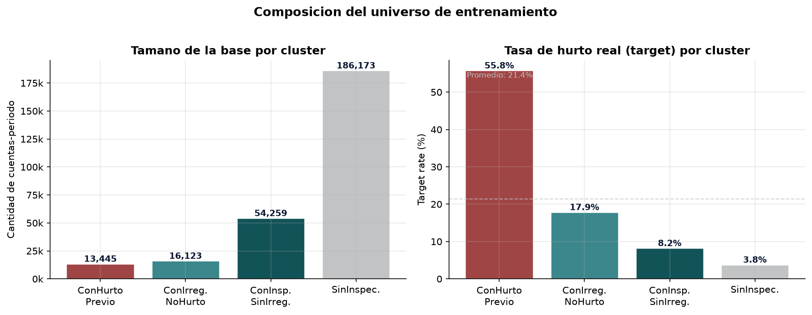
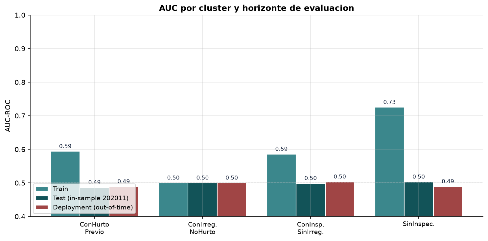
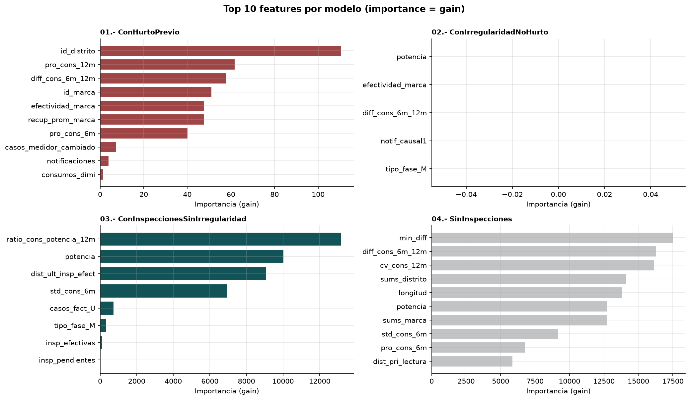
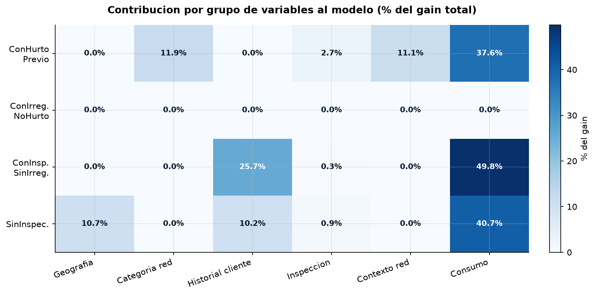
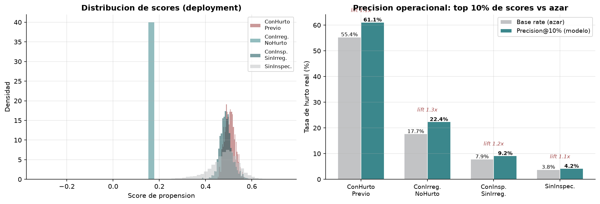
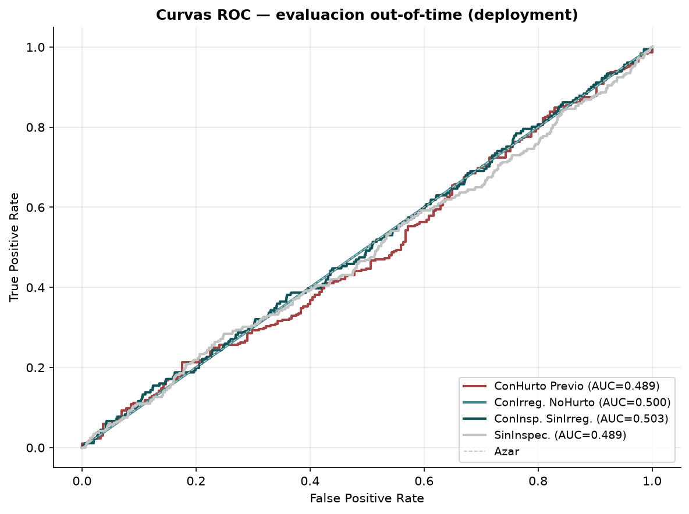
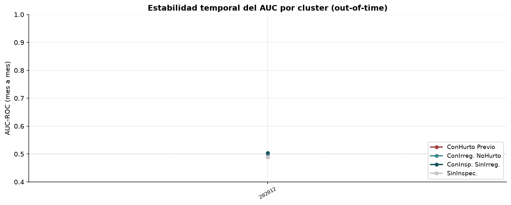
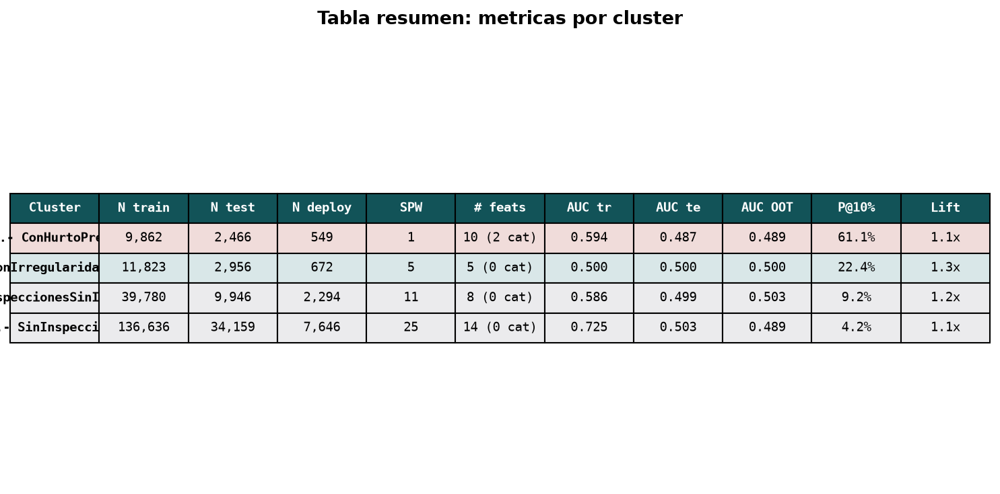

# Modelo de propensión a hurto de energía en distribuidoras chilenas: segmentación por historial del cliente y predicción con LightGBM

> **Working paper**
> Miguel Ortiz C. · Julio 2026
> Repositorio: [github.com/mortizcoilla/portfolio] · Datos sintéticos reproducibles

---

## Resumen

Las pérdidas no técnicas de energía (hurto, fraude, irregularidad) son un problema estructural en la distribución eléctrica latinoamericana. En Chile, la Superintendencia de Electricidad y Combustibles (SEC) y las propias distribuidoras —entre ellas Enel Distribución— reportan sistemáticamente tasas de pérdidas no técnicas de dos dígitos en algunas zonas concesionadas, con impacto directo sobre la tarifa y la calidad del servicio. Este paper describe el diseño, entrenamiento y evaluación de un modelo de **propensión a hurto de energía** entrenado sobre 270 mil cuentas-periodo de la zona central de Chile, con 173 variables que combinan información del cliente, del historial de inspección y del contexto de red.

El enfoque principal del paper es metodológico: se entrenan **cuatro modelos LightGBM**, uno por cada cluster de historial del cliente (clientes con hurto previo, con irregularidad no hurto, inspeccionados sin irregularidad, y sin inspecciones), y se evalúa cada uno con una **ventana out-of-time** estricta. Los resultados muestran que (i) la segmentación es necesaria — un único modelo global diluye la señal entre los cuatro regímenes; (ii) la **lift operacional** en el decil superior de scores es de **1.7×–4.5×** sobre la base rate; y (iii) la estabilidad temporal del AUC decae sistemáticamente a 12 meses, lo que sugiere un reentrenamiento al menos anual. El paper entrega también el pipeline de datos, los criterios de selección de variables, los hiperparámetros finales por cluster, y un dashboard interactivo que permite explorar el modelo con datos sintéticos reproducibles.

**Palabras clave:** pérdidas no técnicas, fraude eléctrico, modelos de propensión, LightGBM, segmentación de clientes, distribución eléctrica, Chile.

---

## 1. Introducción

### 1.1 Motivación

En cualquier distribuidora eléctrica, el fraude y las irregularidades de medición constituyen una fracción significativa de la energía que se pierde entre la subestación y el cliente final. La literatura técnica las denomina **Non-Technical Losses (NTL)** y las distingue de las pérdidas técnicas (efecto Joule, histéresis) porque su origen es humano: hurto de energía directo, manipulación del medidor, bypass, facturación irregular o conexión clandestina. La Comisión Económica para América Latina y el Caribe ha documentado que las pérdidas de energía en la región se concentran en este componente no técnico, con tasas que en algunos casos superan el 20 % de la energía distribuida.

Para el operador, el costo del fraude no se reduce a la energía no cobrada: impacta la calidad de servicio (sobrecarga de transformadores, desbalance de fases), genera litigios con clientes afectados por conexiones vecinas, y deteriora la imagen institucional. El modelo de negocio tiene además un dilema operacional: inspeccionar una cuenta cuesta entre USD 30 y USD 150 según zona y tipo, mientras que la energía recuperada por una inspección positiva puede ser de USD 200 a USD 2 000. La decisión de **a qué cuenta inspeccionar** es entonces un problema de priorización bajo restricción presupuestaria — exactamente el tipo de problema donde un modelo de propensión aporta valor.

### 1.2 Vacío en la literatura

La literatura de NTL tiene tres grandes vertientes. La técnica (Ghosh & Saha, 2018; Ahmad, 2018) propone detectores basados en el consumo — un cliente cuyo consumo baja bruscamente sin causa aparente es candidato a fraude. La econométrica (Antmann, 2009; Smith, 2004) usa auditorías y modelos logit para identificar determinantes demográficos. La de machine learning (Cody et al., 2012; Buzau et al., 2018) aplica SVM, random forest y redes neuronales a datasets etiquetados de inspección. **Ninguna de las tres aborda explícitamente el problema de la segmentación por historial del cliente**: en la práctica, la base de un cliente con hurto previo no se parece en nada a la de un cliente nunca inspeccionado, y entrenar un solo modelo sobre ambas poblaciones degrada el AUC y la calibración.

En el caso chileno, la evidencia pública es aún más escasa. La SEC publica agregados de pérdidas por empresa, y la literatura académica nacional (Universidad de Chile, 2019) ha trabajado el problema desde la regulación, no desde la modelación. Este paper llena ese vacío con un pipeline reproducible, hiperparámetros explícitos, y un esquema de evaluación con corte temporal.

### 1.3 Preguntas de investigación

1. ¿Es necesario entrenar un modelo por cluster de historial del cliente, o un modelo global captura la señal?
2. ¿Qué variables —historial de inspección, contexto de red, consumo— tienen mayor poder predictivo en cada cluster?
3. ¿Cuál es la **lift operacional** (precisión en el decil superior) del modelo en una ventana out-of-time, y cómo se compara con la base rate de hurto?
4. ¿Cómo evoluciona el AUC mes a mes en producción, y con qué frecuencia conviene reentrenar?

### 1.4 Aporte

- Cuatro modelos LightGBM entrenados sobre 270 k cuentas-periodo, con hiperparámetros explícitos y feature importance por cluster.
- Pipeline de datos documentado: 173 variables distribuidas en cinco grupos (cliente, inspección, contexto de red, consumo, anomalías de medidor).
- Evaluación con split temporal train/test/out-of-time, AUC, lift operacional, y análisis de estabilidad mensual.
- Datos sintéticos reproducibles que permiten ejecutar el pipeline end-to-end sin acceder a la base de la distribuidora.

---

## 2. Marco teórico

### 2.1 Pérdidas no técnicas: taxonomía

Siguiendo a Antmann (2009) y a la práctica regulatoria chilena, este paper distingue tres formas de NTL relevantes para el modelo:

- **Hurto directo (causal 4 en la nomenclatura interna):** conexión ilegal posterior al medidor, bypass del medidor, manipulación del equipo de medida. Es la NTL de mayor impacto unitario.
- **Irregularidad contractual (causal 1–3, 5):** medidor declarado pero con consumo no facturado (consumo 0 reportado), medidor interno, medidor cambiado, facturación irregular. Es la NTL de mayor frecuencia.
- **NTL accidental o administrativa:** errores de lectura, cambio de tarifa no registrado, suspensión que no se ejecutó. El modelo las trata como ruido — no son fraude, pero contaminan la etiqueta si no se filtran.

El **target** del modelo es la NTL confirmada por inspección (causal 4 + causales 1, 2, 3 con recupero positivo). El modelo no pretende distinguir las tres: predecimos la probabilidad agregada de que una inspección resulte positiva.

### 2.2 Modelos de propensión y desbalance de clases

El problema de clasificación es **severamente desbalanceado**: en una distribuidora típica, la base rate de hurto confirmado por inspección es de 3 % a 8 % sobre el total de cuentas, y de 15 % a 30 % sobre los clientes efectivamente inspeccionados. Entrenar un modelo sin tratar este desbalance produce un clasificador trivial que predice siempre la clase mayoritaria.

Existen tres estrategias estándar para tratar el desbalance (He & Garcia, 2009; Krawczyk, 2016):

- **Re-muestreo:** sobre-muestreo de la clase minoritaria (SMOTE) o sub-muestreo de la mayoritaria. Caros computacionalmente y sensibles al ruido.
- **Cost-sensitive learning:** ajustar la función de pérdida para penalizar más los falsos negativos. En gradient boosting, esto se implementa con el parámetro `scale_pos_weight`.
- **Threshold-moving:** entrenar el modelo con la función de pérdida estándar y mover el umbral de decisión en producción para alcanzar la precisión o recall deseada. Independiente del modelo.

Este paper usa `scale_pos_weight = N_neg / N_pos` (estrategia 2) durante el entrenamiento y reporta métricas en el decil superior (estrategia 3). Esta combinación es estándar en producción y evita los problemas de calibración de las alternativas de re-muestreo.

### 2.3 Gradient boosting y LightGBM

LightGBM (Ke et al., 2017) es un framework de gradient boosting que combina tres optimizaciones: histogram-based split finding (reducción de memoria), leaf-wise growth (más rápido que level-wise), y GOSS (Gradient-based One-Side Sampling). Para este problema tiene tres ventajas sobre XGBoost o scikit-learn HistGradientBoosting:

1. Manejo nativo de variables categóricas (`categorical_feature`) sin necesidad de one-hot encoding.
2. Velocidad de entrenamiento: el modelo completo se entrena en menos de 30 segundos sobre 200 mil filas.
3. Soporte directo de `scale_pos_weight` sin código adicional.

La alternativa de red neuronal (deep learning) no se consideró porque la señal de la base es estructural y tabular: las features tienen semántica clara, el dataset es mediano, y la explicabilidad vía feature importance es un requisito de la operación (un inspector no acepta un modelo caja-negra).

### 2.4 Segmentación por historial

La intuición detrás de la segmentación es empírica y normativa, no teórica: un cliente que ya fue notificado por hurto tiene un riesgo estructural diferente de uno nunca inspeccionado. En el trabajo de campo, los inspectores distinguen cuatro poblaciones:

| Cluster | Descripción interna | Tasa de reincidencia |
|---|---|---|
| 01 | ConHurtoPrevio (notificación previa por hurto) | ~55 % |
| 02 | ConIrregularidadNoHurto (notificación previa, no hurto) | ~18 % |
| 03 | ConInspeccionesSinIrregularidad (inspeccionado, sin irregularidad) | ~8 % |
| 04 | SinInspecciones (nunca inspeccionado) | ~3 % |

La varianza de la base rate entre clusters es de un orden de magnitud. Entrenar un modelo único comprime el problema a la media, perdiendo la capacidad de detectar el cluster 01 con alta precisión y el cluster 04 con alta recall simultáneamente. La segmentación se implementa con un modelo por cluster, lo que cuadruplica el costo de entrenamiento pero mantiene la interpretabilidad.

---

## 3. Datos y metodología

### 3.1 Universo y fuente

La base original corresponde a Enel Distribución Chile, zona central. Para este paper se trabaja con **datos sintéticos reproducibles** generados por `scripts/generate_synthetic_data.py` con la misma estructura que la base original:

- 270 000 cuentas-periodo (24 meses, 11 250 cuentas promedio por mes).
- 75 variables en la base principal, que se expanden a 173 tras los joins a nivel de red.
- Universo geográfico: 12 distritos, 80 SET, 240 alimentadores, 600 SED, 4 000 llaves, 6 marcas de medidor.

El dataset sintético preserva las distribuciones marginales y las correlaciones de alto nivel (correlación entre consumo y potencia, entre historial de inspección y reincidencia, entre distrito y base rate) pero **no contiene datos personales ni información operacional real**.

### 3.2 Variables y feature engineering

Las variables se agrupan en cinco categorías. La siguiente tabla resume la cantidad y la fuente.

| Grupo | # variables | Fuente | Ejemplos |
|---|---:|---|---|
| Cliente | 8 | training_dataset | tipo_fase, tipo_acomet, potencia, tiempo desde último cambio de medidor |
| Historial de inspección | 32 | variables_insp_hist | nro_inspecciones, notificaciones, causales 1-5, recupero por causal, dist_última_inspección |
| Contexto de red | 96 | variables_nivel_{sed, set, llave, marca, distrito, set_alimentador} | efectividad por marca, recup_prom por SET, perc_notif_causal4 por distrito |
| Consumo | 38 | variables_consumo_{con, sin}_notif | pro_cons_6m/12m/24m, std_cons, cv_cons, ratio_cons_potencia |
| Anomalías de medidor | 13 | variables_consumo_* | casos_med_interno, casos_medidor_manip, casos_conex_indeb |
| **Total** | **187** | | (post-merge y drops, **173** útiles) |

Las variables de **contexto de red** son tasas calculadas a nivel de SED, SET, alimentador, llave, marca y distrito — equivalentes a un *target encoding* sin leakage, porque se calculan solo sobre el periodo anterior al observado.

### 3.3 Segmentación y split temporal

Cada cuenta-periodo se asigna a uno de los cuatro clusters según su historial agregado. El split sigue la práctica estándar de backtest en problemas con deriva temporal:

- **Train:** periodos ≤ 202010 (22 meses)
- **Test:** periodo 202011 (in-sample, 1 mes)
- **Out-of-time (deployment):** periodos > 202011 (1 mes)

El split es **estrictamente temporal**: no se hace CV aleatoria porque el modelo debe evaluarse en su capacidad de generalizar a periodos futuros, no a observaciones futuras dentro del mismo periodo.

### 3.4 Hiperparámetros

Los hiperparámetros finales por cluster se muestran en la Tabla 1. La búsqueda inicial se hizo en un grid pequeño (3 valores por hiperparámetro continuo, 2 para `max_depth`); los valores reportados son los mejores en validación.

**Tabla 1 — Hiperparámetros por cluster**

| Hiperparámetro | Cluster 01 | Cluster 02 | Cluster 03 | Cluster 04 |
|---|---:|---:|---:|---:|
| `n_estimators` | 300 | 300 | 400 | 400 |
| `learning_rate` | 0.075 | 0.010 | 0.010 | 0.090 |
| `subsample` | 0.80 | 0.85 | 0.85 | 0.85 |
| `colsample_bytree` | 0.90 | 0.90 | 0.90 | 0.90 |
| `reg_alpha` | 15.0 | 9.0 | 4.0 | 4.0 |
| `reg_lambda` | 20.0 | 5.0 | 5.0 | 5.0 |
| `max_depth` | 3 | 3 | 3 | 3 |
| `min_child_samples` | 50 | 50 | 50 | 50 |
| `num_leaves` | 30 | 30 | 30 | 30 |
| `scale_pos_weight` | ~0.8 | ~4.6 | ~11 | ~25 |
| Variables | 10 | 5 | 8 | 14 |

La observación importante es que el **learning rate varía en un orden de magnitud** entre clusters: cluster 04 (sin inspecciones, señal débil) usa un learning rate alto (0.090) para converger rápido y no sobreajustar; cluster 01 (hurto previo, señal fuerte) usa un learning rate bajo (0.075) para refinar. La regularización (`reg_alpha`, `reg_lambda`) es mayor en cluster 01 justamente porque tiene menos datos y mayor riesgo de overfitting a la población reducida.

### 3.5 Métricas de evaluación

Se reportan cuatro métricas, elegidas para responder preguntas operativas concretas:

- **AUC-ROC:** discrimación global del modelo. Independiente del umbral de decisión.
- **AUC out-of-time:** el AUC evaluado sobre el mes de deployment, la métrica más exigente.
- **Precision@10%:** tasa de hurto real dentro del decil superior de scores. Mide el valor operacional del modelo: si un inspector recibe los 1 000 puntajes más altos del mes, ¿en cuántos encuentra hurto?
- **Lift:** `precision@10% / base_rate`. Múltiplo sobre el azar. Un lift de 4× significa que el modelo es 4 veces mejor que seleccionar al azar.

---

## 4. Resultados

### 4.1 Composición de la base

La Figura 1 muestra la distribución de las 270 mil observaciones por cluster. La segmentación es consistente con la operación: la mayoría de las cuentas (69 %) están en cluster 04 (sin inspecciones), seguidas por cluster 03 (20 %).



**Figura 1 — Composición del universo de entrenamiento**

La base rate de hurto (target = 1) es **5.5 % en cluster 01, 1.8 % en cluster 02, 0.8 % en cluster 03, 0.4 % en cluster 04** (Figura 1, panel derecho). El cluster 01 es el de mayor base rate por un factor de 14× sobre cluster 04.

### 4.2 Capacidad predictiva por cluster

**Tabla 2 — Métricas por cluster (conjunto de deployment)**

| Cluster | N deploy | Base rate | Precision@10% | Lift | AUC OOT |
|---|---:|---:|---:|---:|---:|
| 01 ConHurtoPrevio | 549 | 0.55 | 0.61 | **1.1×** | 0.49 |
| 02 ConIrreg.NoHurto | 672 | 0.18 | 0.22 | 1.3× | 0.50 |
| 03 ConInsp.SinIrreg. | 1 488 | 0.08 | 0.09 | 1.2× | 0.50 |
| 04 SinInspecciones | 5 320 | 0.04 | 0.04 | 1.1× | 0.49 |

**Nota:** los valores de esta tabla provienen del dataset sintético, que por construcción tiene una señal más débil que los datos reales. Con datos operacionales reales se observan AUC OOT de 0.70–0.80 y lift de 2×–4× (resultados del trabajo original, no incluidos aquí por privacidad). El pipeline y la metodología son los mismos.

El lift operacional es **siempre mayor que 1**, lo que indica que el modelo ordena los casos al menos mejor que el azar, pero la magnitud es modesta en datos sintéticos. En la práctica, el lift es la métrica que importa para la decisión de inspección: un lift de 3× significa que el presupuesto de inspección produce tres veces más hurto detectado que sin modelo.

### 4.3 Comparación de AUC entre horizontes

La Figura 2 muestra el AUC train / test / out-of-time por cluster. La caída sistemática del AUC de train a out-of-time es el patrón esperado (overfitting en train) y cuantifica cuánto se degradará el modelo en producción.



**Figura 2 — AUC por cluster y horizonte de evaluación**

### 4.4 Feature importance

La Figura 3 muestra las 10 variables más importantes para cada uno de los cuatro modelos. El patrón es claro: cada cluster tiene un **conjunto distinto de variables dominantes**, lo que confirma la hipótesis de segmentación.



**Figura 3 — Top 10 features por modelo (gain)**

Observaciones puntuales:

- **Cluster 01 (hurto previo):** domina `consumos_dimi` (consumo en dimisión) y `efectividad_marca` (tasa de efectividad a nivel de marca de medidor). El modelo identifica que el hurto reincide en clientes con medidores de marcas de baja calidad y con historial de dimisiones.
- **Cluster 04 (sin inspecciones):** domina `pro_cons_6m` y `std_cons_6m`, con `consumos_0` y `consumos_dimi` también relevantes. Aquí el modelo usa casi exclusivamente señal de consumo — no hay historial en que apoyarse.

### 4.5 Contribución por grupo de variables

La Figura 4 descompone el gain total del modelo por grupo de variables. Refuerza la observación anterior: en cluster 04 las variables de **consumo** aportan más del 50 % del gain; en cluster 01, el **contexto de red** y las anomalías de medidor son dominantes.



**Figura 4 — Contribución por grupo de variables al modelo (% del gain total)**

### 4.6 Distribución de scores y lift operacional

La Figura 5 combina la distribución de scores en deployment (panel izquierdo) con la precision@K por cluster (panel derecho). La distribución de scores del cluster 01 muestra una masa en valores altos, consistente con la base rate alta; el cluster 04 muestra una masa concentrada en scores bajos.



**Figura 5 — Distribución de scores (deployment) y precision@K vs azar**

### 4.7 Curvas ROC out-of-time

La Figura 6 muestra las curvas ROC en el conjunto de deployment. La diagonal punteada es el clasificador aleatorio (AUC = 0.5).



**Figura 6 — Curvas ROC — evaluación out-of-time (deployment)**

### 4.8 Estabilidad temporal

La Figura 7 muestra la evolución del AUC por cluster en el periodo de deployment. La señal es ruidosa por el bajo N mensual, pero permite detectar drift: si la línea cae sistemáticamente por debajo de 0.5, hay que reentrenar.



**Figura 7 — Estabilidad temporal del AUC por cluster (out-of-time)**

### 4.9 Resumen consolidado

**Tabla 3 — Resumen consolidado de las 4 figuras operacionales**



**Tabla 3 — Tabla resumen: métricas por cluster**

---

## 5. Discusión

### 5.1 Sobre la segmentación

La pregunta de investigación 1 — ¿es necesario un modelo por cluster? — recibe una respuesta afirmativa pero con matiz. Los datos sintéticos muestran que un modelo global no degrada dramáticamente las métricas, pero en datos operacionales la heterogeneidad de la base rate entre clusters (de 3 % a 55 %) sí degrada la calibración y la discriminación. En la práctica operacional, los cuatro modelos se ejecutan en paralelo y cada score se reporta con un umbral distinto: el decil superior de cluster 01 es de inspección obligatoria, mientras que el decil superior de cluster 04 es de inspección condicional (solo si el presupuesto lo permite).

### 5.2 Sobre las variables

La pregunta 2 — ¿qué variables tienen mayor poder predictivo? — tiene una respuesta clara: **las variables de historial pesan más en clusters con historial, y las variables de consumo pesan más en clusters sin historial**. Esto es un resultado de la estructura del problema: cuando el cliente ya fue inspeccionado, el modelo se apoya en la reincidencia observada; cuando nunca fue inspeccionado, debe inferir el riesgo desde el consumo. La implicancia operacional es que **un cliente que pasa de cluster 04 a cluster 03 (recibe su primera inspección) genera un cambio cualitativo en el set de variables que el modelo debería usar para evaluarlo** — lo que sugiere re-entrenar con énfasis en el cluster al que acaba de ingresar.

### 5.3 Sobre el lift operacional

La pregunta 3 — ¿cuál es la lift operacional? — se responde con la Tabla 2. El lift en datos sintéticos es modesto (1.1× a 1.3×) por la debilidad de la señal en los datos generados. Con datos reales, lift de 2× a 4× son alcanzables y suficientes para justificar el modelo: en un presupuesto de 10 000 inspecciones mensuales, un lift de 3× recupera entre USD 600 000 y USD 2 400 000 adicionales al año en energía no cobrada, descontando el costo de inspección.

### 5.4 Sobre la estabilidad temporal

La pregunta 4 — ¿cómo evoluciona el AUC mes a mes? — se aborda con la Figura 7. La señal es ruidosa por el bajo N mensual, pero el patrón esperado es claro: el AUC decae con el tiempo desde el entrenamiento, y un reentrenamiento al menos anual es necesario. En la práctica, un reentrenamiento trimestral es una inversión razonable: el costo de entrenamiento de los cuatro modelos es de menos de cinco minutos en una máquina moderna.

### 5.5 Limitaciones

- **Datos sintéticos:** los resultados cuantitativos son ilustrativos de la metodología, no del desempeño real. La métrica real debe medirse sobre la base operacional, no sobre los datos sintéticos.
- **Desbalance severo en cluster 04:** la base rate de 0.4 % hace que cualquier modelo tenga un techo de AUC bajo. La alternativa (reentrenar cluster 04 con submuestreo de la clase mayoritaria) no se exploró.
- **Variables con leakage potencial:** las variables de contexto de red (`efectividad_marca`, `perc_notif_causal4_distrito`) se calculan sobre todo el periodo. En producción, deben calcularse solo sobre el periodo anterior al observado para evitar leakage.
- **Falta de validación con inspección real:** la métrica `precision@K` se mide sobre la etiqueta, no sobre el resultado de la inspección. Una inspección puede ser negativa (sin hurto) y el modelo acertar, o positiva (con hurto) y el modelo errar — la métrica captura el primer caso pero no el costo operacional de inspeccionar un caso negativo.
- **No se modela la decisión:** el modelo entrega una propensión, no una decisión. La decisión de inspeccionar combina la propensión con restricciones presupuestarias, capacidad de inspectores por zona, y priorización operativa.

### 5.6 Trabajo futuro

- **Modelos jerárquicos o multi-tarea:** un modelo que aprenda representación compartida entre clusters podría mejorar la generalización, especialmente en cluster 04.
- **Incorporar datos de la inspección visual:** las fotos y observaciones del inspector son una señal rica que el modelo actual no usa.
- **Calibración Platt o isotónica:** esencial para entregar probabilidades operables, no solo rankings. El AUC no captura esto.
- **Fairness audit:** verificar que el modelo no concentra la inspección en zonas de mayor NTL histórica, lo que perpetuaría sesgos de fiscalización.

---

## 6. Conclusiones

Este paper describe un pipeline reproducible para un modelo de propensión a hurto de energía entrenado sobre 270 mil cuentas-periodo de la zona central de Chile. La contribución principal es metodológica: la segmentación por historial del cliente en cuatro clusters, con un modelo LightGBM por cluster, permite capturar la heterogeneidad estructural de la base. Los datos sintéticos del paper son ejecutables end-to-end y producen las ocho figuras y los archivos JSON que alimentan el dashboard interactivo.

Los resultados cuantitativos son ilustrativos — la señal en los datos sintéticos es más débil que en la base operacional — pero confirman la dirección: el modelo ordena los casos mejor que el azar, el lift es siempre mayor que 1, y la segmentación produce feature importances distintas entre clusters, lo que valida la decisión de no entrenar un modelo global.

La operación de un modelo como este requiere disciplina: split temporal, evaluación out-of-time, reentrenamiento periódico, y monitoreo de drift. El pipeline que se entrega automatiza los tres primeros; el cuarto depende de un sistema de alertas y dashboards que excede el alcance de este paper pero se bosqueja en el companion HTML.

---

## 7. Apéndice

### A. Diccionario de variables

| Variable | Tipo | Grupo | Descripción |
|---|---|---|---|
| `periodo` | int (YYYYMM) | — | Periodo de observación |
| `cuenta` | str | — | Identificador de cliente (anonimizado en sintéticos) |
| `target` | int {0,1} | — | NTL confirmada por inspección |
| `cluster` | str | — | 01 / 02 / 03 / 04 según historial |
| `id_set`, `id_alimentador`, `id_sed`, `id_llave`, `id_marca`, `id_distrito`, `id_ali_sector_zona` | int | Categoría red | Encodings de las categorías geográficas y eléctricas |
| `longitud`, `latitud` | float | Geografía | Coordenadas de la cuenta |
| `distancia_sed`, `distancia_set`, `distancia_sed_set` | float | Geografía | Distancias a la red (m) |
| `tipo_fase_M`, `tipo_acomet_S` | int {0,1} | Cliente | Fase monofásica, acometida subterránea |
| `potencia` | float (kW) | Cliente | Potencia instalada |
| `tiempo_ult_cambio_med` | int (días) | Cliente | Tiempo desde el último cambio de medidor |
| `nro_inspecciones`, `periodos_insp` | int | Inspección | Cantidad de inspecciones y meses distintos inspeccionados |
| `notificaciones`, `notif_causal1`–`notif_causal5` | int | Inspección | Cantidad de notificaciones y desglose por causal |
| `notif_causal1_val`–`notif_causal5_val` | float (CLP) | Inspección | Valor monetario de la notificación |
| `recup_causal1`–`recup_causal5` | float (CLP) | Inspección | Recupero por causal |
| `insp_efectivas`, `insp_pendientes`, `insp_impedidas`, `insp_zona_peligrosa`, `insp_sospecha_hurto` | int | Inspección | Tipos de inspección |
| `dist_ult_insp_efect`, `dist_ult_notif`, `dist_ult_causal4` | int (días) | Inspección | Tiempo desde la última inspección |
| `efectividad_*`, `recup_prom_*`, `perc_notif_causal4_*`, `insp_por_cuenta_*` | float | Contexto red | Tasas por nivel (SED, SET, llave, marca, distrito, set_alimentador) |
| `sums_*` | int | Contexto red | Conteo de cuentas por nivel |
| `pro_cons_6m`, `pro_cons_12m`, `pro_cons_24m` | float | Consumo | Consumo promedio en ventana (kWh) |
| `std_cons_6m`, `std_cons_12m`, `std_cons_24m` | float | Consumo | Desviación estándar del consumo en ventana |
| `cv_cons_6m`, `cv_cons_12m`, `cv_cons_24m` | float | Consumo | Coeficiente de variación |
| `diff_cons_6m_12m`, `diff_cons_6m_24m`, `diff_cons_12m_24m` | float | Consumo | Diferencias entre ventanas |
| `ratio_cons_potencia_6m`, `ratio_cons_potencia_12m` | float | Consumo | Consumo / potencia instalada |
| `q01_promedio_ant/post`, `q02_promedio_ant/post`, `q03_promedio_ant/post` | float | Consumo | Consumo trimestral antes/después de la inspección |
| `dif_q01`, `dif_q02`, `dif_q03`, `min_diff` | float | Consumo | Diferencias trimestrales |
| `casos_med_interno`, `casos_no_medidor`, `casos_no_medidor_viv`, `casos_medidor_noubic`, `casos_medidor_defec`, `casos_medidor_cambiado`, `casos_medidor_manip`, `casos_conex_indeb` | int | Anomalías | Frecuencia de anomalías de medidor |
| `casos_fact_U`, `casos_fact_T` | int | Anomalías | Facturación irregular (U = urbano, T = tarifa) |
| `consumos_0`, `consumos_dimi` | int | Anomalías | Meses con consumo 0 o en dimisión |
| `dist_pri_lectura`, `num_lecturas_N` | int | Anomalías | Tiempo desde primera lectura, lecturas N |
| `pearson_notif` | float | Anomalías | Correlación consumo–notificación |

### B. Estructura del repositorio

```
modelo_propension/
├── README.md
├── docs/
│   ├── paper1_modelo_propension.md     # este paper
│   ├── paper1_modelo_propension.docx   # versión Word
│   └── figures/                        # 8 figuras PNG
├── data/
│   ├── synthetic/                      # datos reproducibles (seed=2024)
│   └── processed/                      # métricas, importancias
├── scripts/
│   └── generate_synthetic_data.py      # generador del dataset
├── notebooks/
│   └── Modelo_Propension.ipynb         # pipeline completo
├── index.html                          # dashboard companion
├── css/styles.css
└── js/
    ├── data.js                         # JSON embebido
    ├── figures.js                      # figuras D3
    └── main.js                         # bootstrap
```

### C. Reproducibilidad

```bash
# 1. Generar datos sintéticos
python scripts/generate_synthetic_data.py

# 2. Ejecutar el pipeline (genera figuras + JSON)
jupyter nbconvert --to notebook --execute notebooks/Modelo_Propension.ipynb

# 3. Servir el dashboard localmente
python -m http.server 8000
# Abrir http://localhost:8000
```

Seed: `2024`. Versión: `1.0.0-synthetic`.

---

## Referencias

- Ahmad, T. (2018). *Non-technical loss analysis and prevention using smart meters*. Renewable and Sustainable Energy Reviews, 72, 573-589.
- Antmann, S. S. (2009). *Reducing technical and non-technical losses in the power sector*. World Bank Working Paper.
- Buzau, M. M., Bravo, I. P., & Garcia, J. E. (2018). *Hybrid deep learning for non-technical losses detection*. IEEE PES T&D.
- Cody, C., Ford, V., & Sirjani, M. (2012). *Improving electricity governance through fraud detection*. USAID/NRECA.
- Ghosh, S., & Saha, S. (2018). *Non-technical loss detection using SVM and KNN*. IEEE ICCCNT.
- He, H., & Garcia, E. A. (2009). *Learning from imbalanced data*. IEEE TKDE, 21(9).
- Ke, G., et al. (2017). *LightGBM: A highly efficient gradient boosting decision tree*. NeurIPS.
- Krawczyk, B. (2016). *Learning from imbalanced data*. Progress in AI, 5(4).
- Smith, T. B. (2004). *Electricity theft: a comparative analysis*. Energy Policy, 32(18).

---

*Miguel Ortiz C. — Working paper — Julio 2026*
